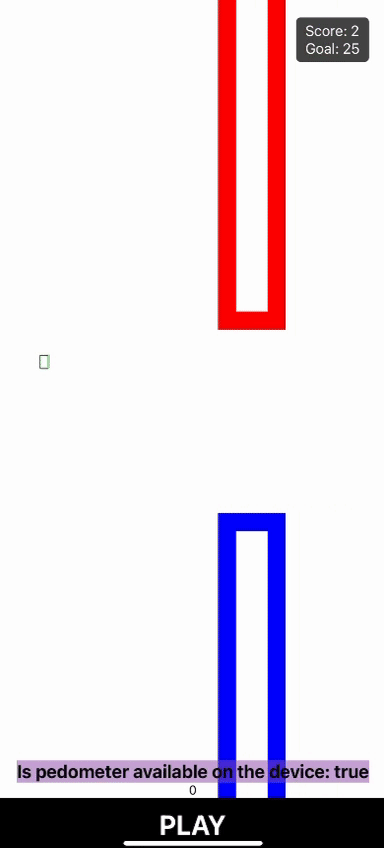

# Smombierun

## Wat is de Smombierun?
De Smombierun is zoals je in de naam al hoort een run, maar dan met een gimmick. Denk bijvoorbeeld aan de high heel race, waar mensen een bepaalde afstand afleggen op hakken.  De Smombierun is net zoiets, maar dan met een ander gekkig aspect. Bij de Smombierun gaan deelnemers hardlopen met hun telefoon in hun hand, waar zij spelletjes op moeten doen. Je doet dus twee dingen tegelijkertijd. Onze Smombierun app is bedoeld om de mensen bezig te houden op hun telefoon, en in beweging. 

Deze hele run is met de bedoeling om mensen meer bewust te maken van het gevaar van telefoongebruik in het verkeer of dagelijks leven. 

## Visuals




## Status
De POC is nog niet 100% compleet, zo missen wij nog betere visuals en de geluidsmelding. Hier hebben wij helaas geen tijd meer voor gehad. Daarintegen kun je het spel wel spelen, gepaard met de stappenteller die een melding geeft wanneer jij niet meer loopt. 

## Components

Hier kan de developer herbruikbare componenten terugvinden

## Hoe te spelen

- Begin met rennen
- Druk op ‘Play’
- Zorg ervoor dat het vierkantje tussen de buizen komt
- Doe dit tot je het doel hebt behaald


## Installatie en set-up instructies voor React Native


Installatie:

```

npm install –global expo cli

```

Opzetten van app:

```

expo init (NaamApp)

```

Testen app met qr-code:

```

Expo start of Expo start --tunnel

```

App testen op een emulator:

```

Expo start

I

```

## Gemaakt met
- React Native- Gebruikte programmeertaal
- JavaScript
- Expo - App op je telefoon om de code to openen
- React Native Expo Sensors
- React Native Sound

## Advies
-	Geef aan het begin van de run een korte uitleg. 
-	Je scant een QR code die je doorverwijst naar de app in de appstore.
-	Geef de deelnemers een nummer.
-	Zorg dat de melding voor het afgaan gepaard gaat met een geluid in de vorm van een luchtalarm. Zo krijgen de toeschouwers mee wanneer iemand af is. 
-	Gebruik verschillende minigames voor variatie. 
-	Gebruik classic/simpele minigames
o	Tetris
o	Flappy Bird – of wel Flapocalypse
o	Doodle Jump
o	Snake
o	Subway Servers simplified
-	Na het eindscherm kun je nergens meer naartoe, of je nu wint of verliest, dit is het laatste scherm.
-	Zorg voor branding in de vorm van merchandise. Laat de deelnemers in shirts lopen met zombies erop, en hun nummer. 


## Auteurs
- Mirac Alakus
- Roos Prinsen
- Daniek de Vocht

Smombierun groep, Semester 4 Open Learning
